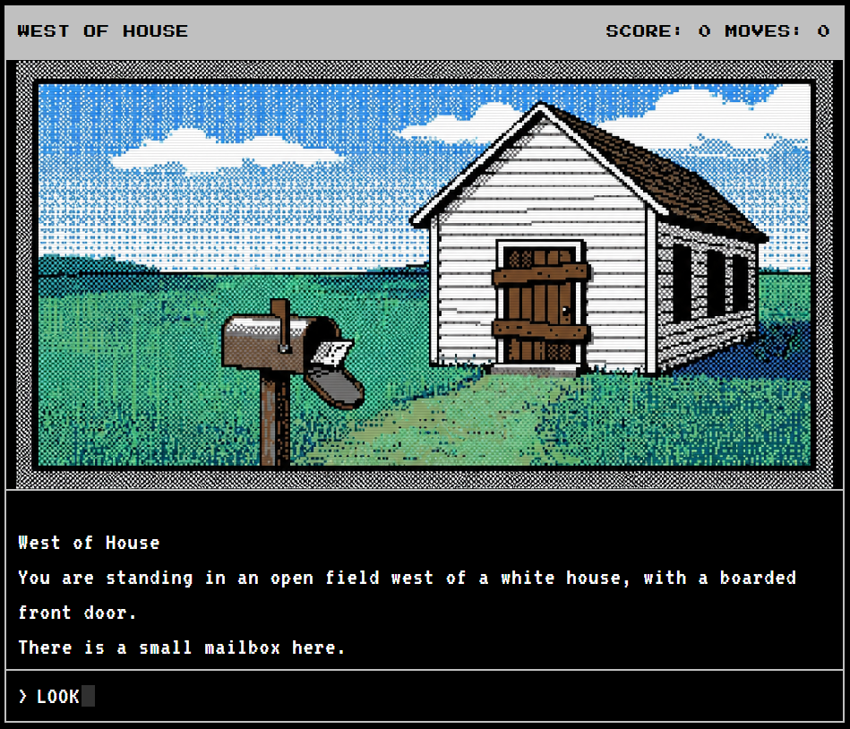
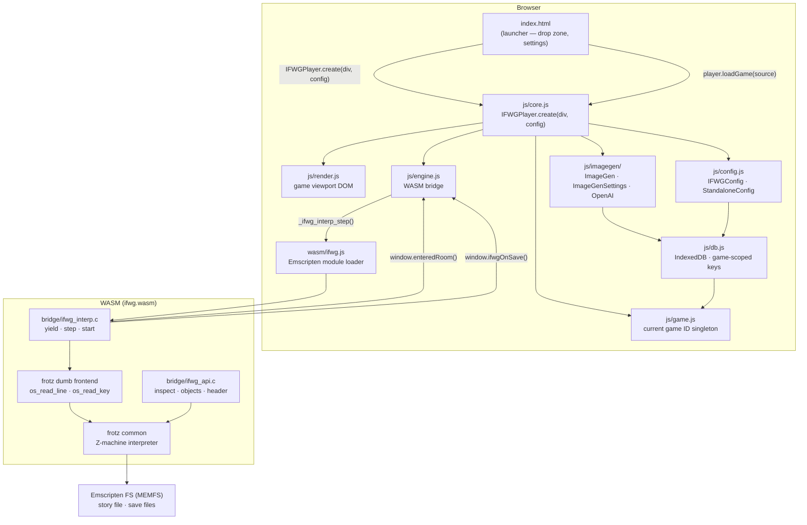
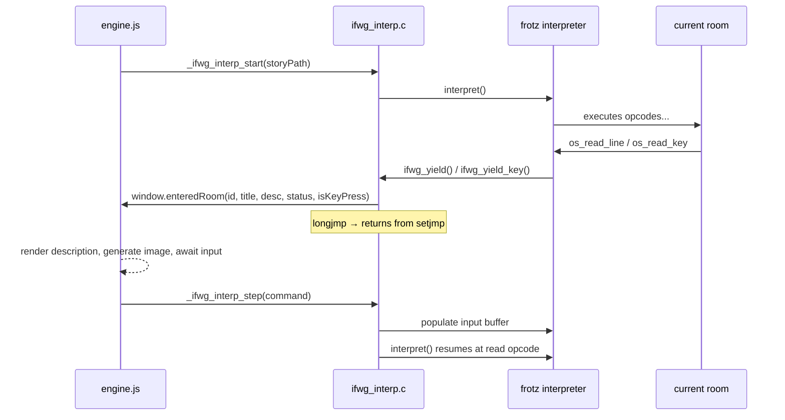
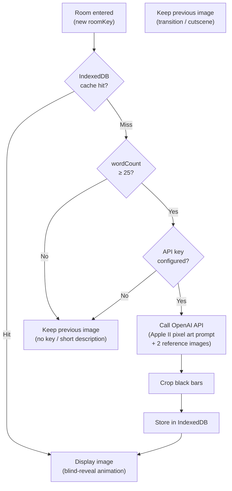

# IF With Graphics

**IF With Graphics** brings artwork to your classic IF adventure games. Load any Z-machine story file, play it as a text adventure, and watch Apple II-style pixel art appear for each room you visit — generated on the fly and cached locally so it never repeats.

---



---

## What It Is

Classic interactive fiction is rich, strange, and deeply atmospheric. This project explores what happens when those worlds are illustrated without losing the feel of the original parser experience.

The target aesthetic is deliberately retro: limited palettes, dithered pixel art, scan-line overlays, and a layout that feels closer to an Apple IIe than a modern game UI. The original text adventure interaction stays at the center — the artwork frames it, not the other way around.

---

## Current State

The player is fully functional. You can drag and drop any Z-machine story file (`.z1`–`.z5`) and play it end to end.

**Working now:**
- Z-machine interpreter via [frotz](https://gitlab.com/DavidGriffith/frotz) compiled to WebAssembly (Emscripten)
- Room detection for V1–V3 games (spec-mandated global 0) and V4+ games (object name lookup)
- AI image generation via OpenAI — Apple II dithered pixel art, one image per room
- Room image caching in IndexedDB — images persist across sessions and are never regenerated unless cleared
- **Save/restore** — C-side `EM_ASM` hook fires after `z_save`; save bytes persisted to IndexedDB and pre-populated into MEMFS on next load; fully transparent to the player
- **Stable game ID** — Z-machine header `release.serial` (e.g. `"119.870917"` for Trinity); stable across different packaging formats, no file hashing
- **Embeddable player widget** — `IFWGPlayer.create(div, config)` returns `{ loadGame(source) }`; launcher chrome (drop zone, settings) lives in the host page, not the player module
- Animated slide transitions between rooms, blind-reveal for new images
- Line-snapped text pagination (SPACE to scroll, any key for press-any-key prompts)
- V4 game support — `os_read_key` handled correctly; tested with Trinity and A Mind Forever Voyaging
- Status bar with room name and score/moves
- Retro disk LED animation while images generate
- Scales to any viewport size via fluid `clamp()`-based typography

**Supported game versions:**
| Version | Example Games | Room ID method |
|---------|--------------|----------------|
| V1–V3 | Zork I/II/III, Hitchhiker's Guide, Planetfall, Enchanter | Global 0 (spec-mandated, always reliable) |
| V4 | Trinity, A Mind Forever Voyaging, Bureaucracy | Object name lookup; falls back to room title when ID is 0 |
| V5 | Beyond Zork, Shogun | Object name lookup |

---

## Architecture

### Full Stack



### Player Directory Layout

```
player/
├── index.html          ← standalone launcher (drop zone, settings, drag/drop)
├── player.css
├── js/
│   ├── index.js        ← barrel export / bundle entry point
│   ├── core.js         ← IFWGPlayer.create(div, config)
│   ├── render.js       ← game viewport DOM only
│   ├── engine.js       ← WASM bridge, save hook
│   ├── config.js       ← IFWGConfig base, StandaloneConfig
│   ├── db.js           ← generic IndexedDB, game-scoped key prefix
│   ├── game.js         ← current game ID singleton
│   ├── imagegen/
│   │   ├── index.js    ← ImageGen, ImageGenSettings
│   │   └── openai.js   ← OpenAI DALL-E provider
│   └── ui/
│       ├── image.js    ← scene image, placeholder, LED animation
│       ├── input.js    ← command input, cursor
│       └── text.js     ← text pagination, slide transitions
├── prompt/
│   ├── prompt1.png     ← reference images sent with every OpenAI request
│   └── prompt2.png
└── wasm/               ← generated by Makefile, gitignored
```

### Player API

`IFWGPlayer.create(container, config)` renders the game viewport into `container` and returns a player object. All launcher chrome (drop zone, file picker, settings panel) lives in the host page.

```javascript
var config = new StandaloneConfig();
var player = IFWGPlayer.create(document.getElementById("app"), config);

player.loadGame(file);              // File object (drag/drop or file picker)
player.loadGame("path/to/game.z5"); // URL — fetched automatically
player.loadGame(bytes);             // Uint8Array or ArrayBuffer
```

### Config & Hooks

`IFWGConfig` is the base class. Override only what your environment needs.

```javascript
class IFWGConfig {
  getWasmPath()                  // → "./wasm/"  (path to wasm/ directory)
  onSave(filename, bytes)        // called after z_save — persist bytes externally
  onRestore(filename, cb)        // called before engine start — cb(bytes | null)
  onGameLoaded(gameId, title)    // called when a game starts
}
```

`StandaloneConfig` extends `IFWGConfig` with IndexedDB persistence for saves and image cache. Keys are scoped by game ID: `<gameId>/saves/<file>` and `<gameId>/images/<roomId>`.

### Image Settings

Image settings are owned by `ImageGen`, not by the config. The host page reads and writes them directly.

```javascript
import { ImageGen, ImageGenSettings } from "./js/imagegen/index.js";

var s = ImageGen.getSettings();     // returns ImageGenSettings
s.getProvider();                    // "openai" | "none"
s.getApiKey();                      // "sk-…"

ImageGen.setSettings(new ImageGenSettings("openai", "sk-…"));
```

`ImageGen.generate()` always checks the IndexedDB cache first. API calls only happen on a cache miss when the description is substantial enough (≥ 25 words). Cached images are served regardless of whether an API key is configured.

### Save / Restore

Save and restore are transparent — the player types `save` / `restore` as normal game commands.

**C side (WASM):**
- `fastmem.c` — `EM_ASM` fires `window.ifwgOnSave(filename)` after a successful `z_save`
- `dinput.c` — `os_read_file_name` silently accepts the default filename for save/restore under Emscripten (no filesystem prompt)

**JS side:**
- `engine.js` reads the saved bytes from MEMFS via `FS.readFile`, passes them to `config.onSave`
- `StandaloneConfig.onSave` stores bytes to IndexedDB under `<gameId>/saves/<basename>`
- On `loadGame`, `config.onRestore` is called before the engine starts; if bytes exist they are written into MEMFS before frotz runs

### Game Identity

The game ID is read directly from the Z-machine header before the story file is written to MEMFS — no file hashing, no round-trip through C.

```
release  = bytes[0x02..0x03]  (16-bit big-endian)
serial   = bytes[0x12..0x17]  (6 ASCII chars)
gameId   = release + "." + serial   →  e.g. "119.870917"
```

This is set on `Game` (singleton) when a game loads. `DB` prepends it automatically to every key.

### WASM Yield / Resume Flow

The bridge uses `setjmp`/`longjmp` to yield control at each input boundary without blocking the browser's main thread.



---

## Image Generation Pipeline



> **Note:** The IndexedDB cache is always checked first — cache hits are served even without an API key and even when the room description is short (e.g. after a `restore`). API generation is only attempted on a cache miss with a substantial description.

---

## Development Setup

### WASM Build

The WASM module is built inside a Docker container with Emscripten.

```bash
# Start the container with a volume mount (first time)
docker run -dit --name ifwg-emsdk-3.1.1 \
  -p 5173:5173 \
  -v "$(pwd):/src" \
  emscripten/emsdk:3.1.1 bash

# Serve the player
docker exec ifwg-emsdk-3.1.1 \
  bash -c "cd /src && python3 -m http.server 5173 --bind 0.0.0.0 &"

# Build WASM
docker exec -w /src/wasm ifwg-emsdk-3.1.1 make
```

Open `http://localhost:5173/player/` in a browser.

### Player JS

```bash
cd player
npm install

npm run lint    # ESLint
npm run build   # esbuild → dist/ifwg-player.js (~17 KB minified)
```

`index.html` has both import variants side by side — comment/uncomment to switch:

```javascript
/* Dev — individual modules (no build step required) */
import { IFWGPlayer } from "./js/core.js";
...

/* Prod — minified bundle
import { IFWGPlayer, StandaloneConfig, ImageGen, ImageGenSettings } from "./dist/ifwg-player.js";
*/
```

---

## Builder (Internal Tool)

The `builder/` directory contains a debug interface for the WASM bridge — load a story file and call individual bridge functions (dump header, dump objects, dump dictionary, walk the object tree, find text) without running the full player UI.

Useful for testing bridge API changes and inspecting Z-machine internals. Internal tool only.

---

## Roadmap

### Near term

- **Slash commands** — `/restart`, `/regen`, `/clear`, `/save`, `/restore`, `/export`, `/help` intercepted before commands reach frotz
- **Pre-generated image library** — commit artwork for major Infocom games directly to this repo under `presets/`; players never need an API key for known games
- **Image compression** — generated images are currently large (~3 MB data URLs); compress before storing in IndexedDB and before committing presets

### Longer term

- **`/export`** — produce a distributable game package (story file + images + player + webRcade feed manifest)
- **Standalone launcher** — prebuilt Go binaries that serve files relative to themselves and open the browser; included in `/export` packages
- **Embed variant** — minimal host page that boots a specific game directly via `player.loadGame(url)` with no launcher chrome
- **webRcade integration** — direct embedding via the config hooks; save/restore via webRcade's cloud platform

---

## License

License information has not been finalized yet.
