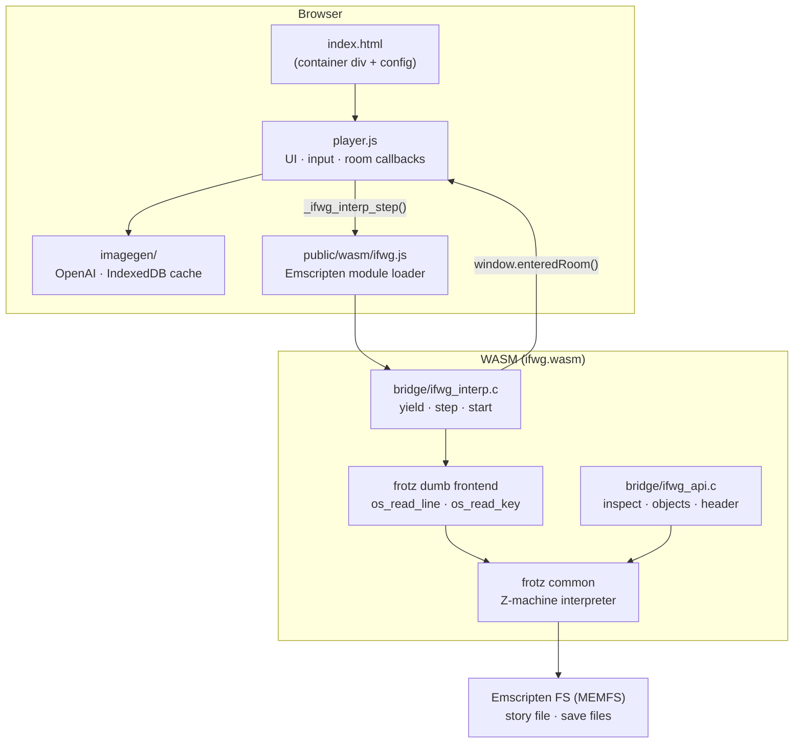
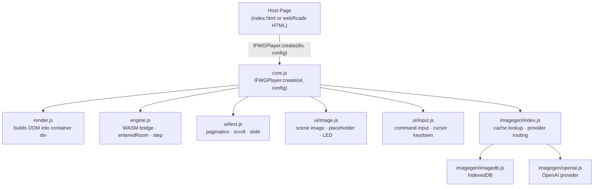
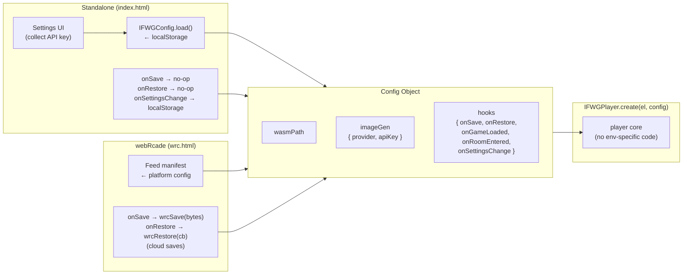
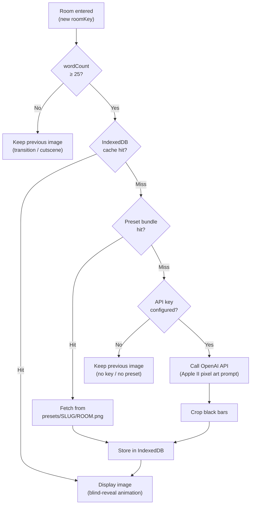

# IF With Graphics

**IF With Graphics** brings room artwork to classic interactive fiction. Load any Z-machine story file, play it as a text adventure, and watch AI-generated Apple II-style pixel art appear for each room you visit — generated on the fly and cached locally so it never repeats.

---

## What It Is

Classic interactive fiction is rich, strange, and deeply atmospheric. This project explores what happens when those worlds are illustrated without losing the feel of the original parser experience.

The target aesthetic is deliberately retro: limited palettes, dithered pixel art, scan-line overlays, and a layout that feels closer to an Apple IIe than a modern game UI. The original text adventure interaction stays at the center — the artwork frames it, not the other way around.

---

## Current State

The player is fully functional. You can drag and drop any Z-machine story file (`.z1`–`.z5`) and play it end to end.

**Working now:**
- Z-machine interpreter via [frotz](https://gitlab.com/DavidGriffith/frotz) compiled to WebAssembly (Emscripten)
- Room detection for V1–V3 games (spec-mandated global 0) and V4+ games (object name lookup)
- AI image generation via OpenAI — Apple II dithered pixel art, one image per room
- Room image caching in IndexedDB — images persist across sessions and are never regenerated unless cleared
- Animated slide transitions between rooms, blind-reveal for new images
- Line-snapped text pagination (SPACE to scroll, any key for press-any-key prompts)
- V4 game support — `os_read_key` handled correctly; tested with Trinity and A Mind Forever Voyaging
- Status bar with room name and score/moves
- Retro disk LED animation while images generate
- Scales to any viewport size via fluid `clamp()`-based typography

**Supported game versions:**
| Version | Example Games | Room ID method |
|---------|--------------|----------------|
| V1–V3 | Zork I/II/III, Hitchhiker's Guide, Planetfall, Enchanter | Global 0 (spec-mandated, always reliable) |
| V4 | Trinity, A Mind Forever Voyaging, Bureaucracy | Object name lookup; falls back to room title when ID is 0 |
| V5 | Beyond Zork, Shogun | Object name lookup |

---

## Architecture

### Full Stack



### WASM Yield / Resume Flow

The bridge uses `setjmp`/`longjmp` to yield control at each input boundary without blocking the browser's main thread.


---

## Player Architecture (Upcoming Refactor)

The player is being refactored from a single monolithic `player.js` into a modular, embeddable widget using ES modules.

### Module Structure



### Pluggable Configuration & Hooks

The core accepts a single config object. Hooks are stubs by default — each host environment overrides only what it needs.



The same core runs identically in both environments. The host page provides the container div and config — nothing else.

```html
<!-- Standalone -->
<div id="app"></div>
<script type="module">
  import { IFWGPlayer } from "./player/core.js";
  import { IFWGConfig  } from "./player/config.js";
  const s = IFWGConfig.load();
  IFWGPlayer.create(document.getElementById("app"), {
    wasmPath: "./player/public/wasm/",
    imageGen: { provider: s.provider, apiKey: s.apiKey },
    hooks: { onSettingsChange: IFWGConfig.save }
  });
</script>

<!-- webRcade -->
<div id="game"></div>
<script type="module">
  import { IFWGPlayer } from "./player/core.js";
  IFWGPlayer.create(document.getElementById("game"), {
    wasmPath: "./player/public/wasm/",
    imageGen: { provider: "openai", apiKey: feedConfig.apiKey },
    hooks: {
      onSave:    (filename, bytes) => wrcSave(filename, bytes),
      onRestore: (filename, cb)    => wrcRestore(filename, cb)
    }
  });
</script>
```

---

## Image Generation Pipeline



> **Note:** The preset bundle (pre-generated images for popular Infocom games, committed to this repo) is planned but not yet implemented. Currently the pipeline goes directly from IndexedDB miss to API generation.

---

## Development Setup

The WASM module is built inside a Docker container with Emscripten. The Python HTTP server serves the player from `/src`.

```bash
# Start the container (first time)
docker run -dit --name ifwg-emsdk-3.1.1 \
  -p 5173:5173 \
  emscripten/emsdk:3.1.1 bash

docker exec ifwg-emsdk-3.1.1 \
  bash -c "cd /src && python3 -m http.server 5173 --bind 0.0.0.0 &"

# Copy source into container
docker cp . ifwg-emsdk-3.1.1:/src/

# Build WASM
docker exec -w /src/wasm-tools/builder ifwg-emsdk-3.1.1 make

# After editing JS/CSS files, copy individually:
docker cp player/player.js  ifwg-emsdk-3.1.1:/src/player/player.js
docker cp player/player.css ifwg-emsdk-3.1.1:/src/player/player.css
```

> **Note:** Docker Desktop Windows volume sync is unreliable in this setup. Always `docker cp` individual files after editing.

Open `http://localhost:5173/player/` in a browser.

---

## Builder (Internal Tool)

The `builder/` directory contains a debug interface for the WASM bridge — load a story file and call individual bridge functions (dump header, dump objects, dump dictionary, walk the object tree, find text) without running the full player UI.

Useful for testing bridge API changes and inspecting Z-machine internals. Internal tool only, no defined long-term roadmap.

---

## Roadmap

### Near term

- **Player refactor** — split `player.js` into ES modules (see architecture above); add config object and hooks system
- **Slash commands** — `/restart`, `/regen`, `/clear`, `/save`, `/restore`, `/export`, `/help` intercepted before commands reach frotz
- **Stable game ID** — replace SHA-256 file hash with Z-machine header `release.serial` (e.g. `"119.870917"` for Trinity); stable across different packaging formats

### Medium term

- **Pre-generated image library** — commit artwork for major Infocom games directly to this repo under `presets/`; players never need an API key for known games
- **Image compression** — generated images are currently ~3MB; compress to ~150–300KB before committing to the repo at scale
- **Save/restore** — C-side `EM_ASM` callback after `os_save_file` fires `hooks.onSave(filename, bytes)`; restore is the reverse; webRcade gets cloud saves for free

### Longer term

- **`/export`** — produce a distributable game package (story file + images + player + webRcade feed manifest + platform launcher binaries)
- **Standalone launcher** — prebuilt Go binaries (checked into `bin/`) that serve files relative to themselves and open the browser; included in `/export` packages so end users need no tooling
- **webRcade integration** — direct embedding via the hooks-based architecture (no iframe); save/restore via webRcade's cloud platform

---

## License

License information has not been finalized yet.
