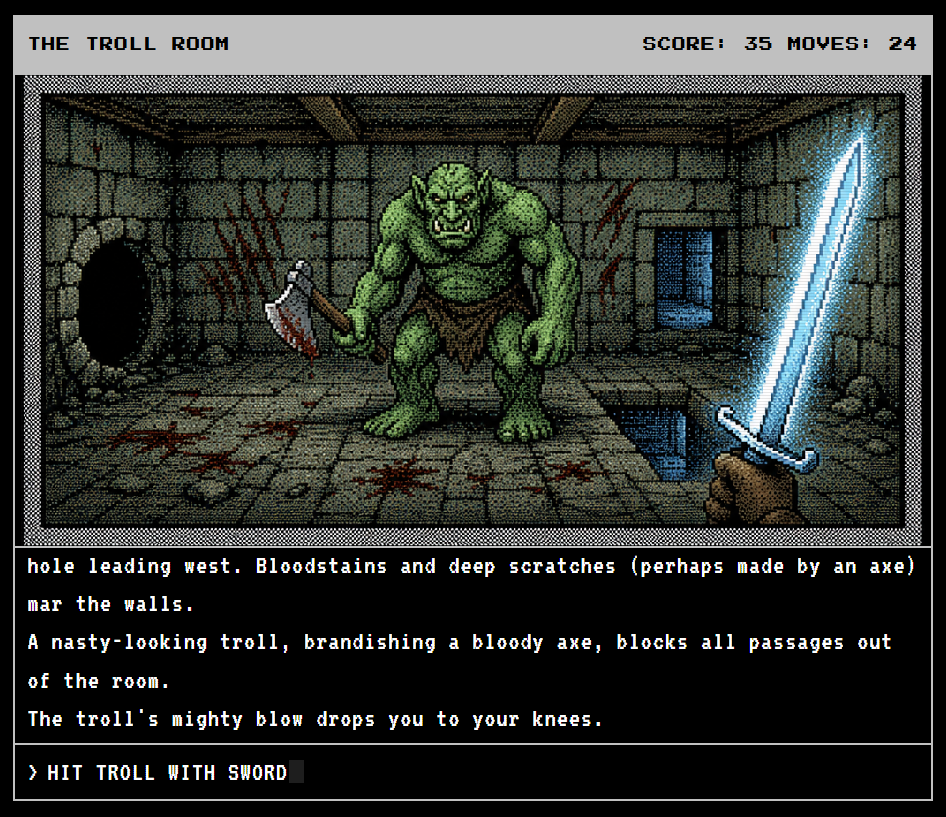

# IF With Graphics (IFWG)

**IF With Graphics** brings AI-generated artwork to classic text adventure games. Load any Z-machine story file, play it as a text adventure, and watch Apple II-style pixel art appear for each room you visit. Images are generated on the fly and cached locally so they never repeat.

> Image generation requires an API key. Games with pre-rendered artwork play without one.

---

  
   
  <i>West of House - Zork I</i>

  
   
  <i>The Troll Room - Zork I</i>

---

## What It Is

Classic interactive fiction is rich, strange, and deeply atmospheric. This project explores what happens when those worlds are illustrated without losing the feel of the original parser experience.

The aesthetic is deliberately retro: limited palettes, dithered pixel art, scan-line overlays, and a layout that feels closer to an Apple IIe than a modern game. The text adventure experience stays at the center. The artwork frames it.

---

## Features

- Drag and drop any Z-machine story file (`.z1` through `.z5`) and play
- AI image generated for each room, cached locally in the browser
- Save and restore work transparently via normal game commands
- Two image generation providers: OpenAI and Google Gemini
- Status bar, animated room transitions, retro disk LED while images load
- Scales to any viewport size

**Supported games:**

| Version | Examples |
|---------|----------|
| V1-V3 | Zork I/II/III, Hitchhiker's Guide, Planetfall, Wishbringer, Enchanter |
| V4 | Trinity, A Mind Forever Voyaging, Bureaucracy |
| V5 | Beyond Zork, Shogun |

---

## Image Generation

Images are generated using an Apple II dithered pixel art prompt paired with reference images to lock in the aesthetic. Results are cropped, compressed to WebP, and cached in IndexedDB. Once an image exists for a room it is never regenerated unless you clear the cache.

**Which provider looks best?**

OpenAI (`gpt-image-2-2026-04-21`) produces the most convincing retro pixel art. The April 2026 release in particular does excellent style transfer from the reference images and is the recommended choice for the classic Apple II theme.

Gemini is faster and cheaper and works well for a more painterly or cinematic look, but does not match the pixel art fidelity of the OpenAI model for this use case.

---

## Running It

The player runs entirely in the browser. Serve the repo root with any static file server and open `/player/` in a browser, then drag in a story file.

To rebuild the WASM interpreter from source, Docker and Emscripten are required. See the `wasm/` directory for the Makefile.

---

## Roadmap

- Slash commands (`/restart`, `/regen`, `/export`, `/help`) intercepted before they reach the interpreter
- Pre-generated image library for major Infocom titles so no API key is needed
- AI room explorer: Claude plays games headlessly, collects descriptions, and batch generates a full image set
- Theme system so the visual style is swappable without touching core code
- Embeddable export packages with a standalone launcher

---

## License

License information has not been finalized yet.
